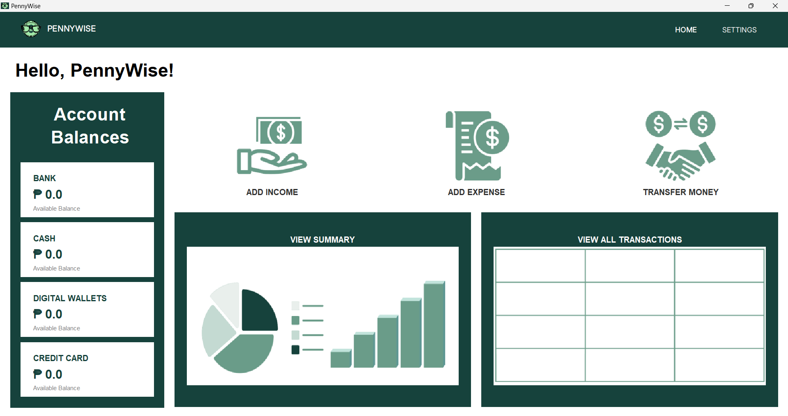
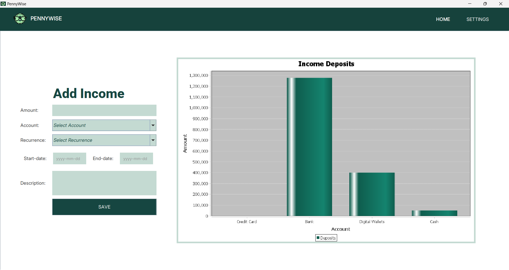
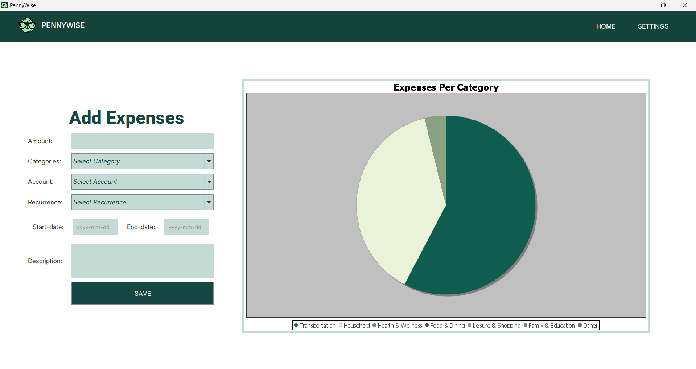
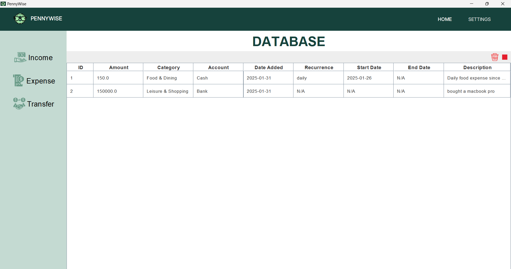

# PennyWise Finance-Tracker

PennyWise is a simple finance tracker that allows users to track their income, expenses, and money from different accounts. It encourages users to take full control over their finances and thus make informed decisions.

## Screenshots









## Features
- Add an income data
- Add an expense data
- Transfer money between different accounts
- Specify recurrence transactions (income, expense transfer)
- Set a future transaction
- Delete a transaction
- End a recurring transaction
- View aggregates (such as balances per account and expenses per category)
- View transaction history

## Requirements
> **Note:** External dependencies are already in the lib folder 
- Sqlite
- Java

## How to Run the Program
Compile
```
javac -cp "lib/*" -sourcepath src src/backend/FinanceBackend.java src/transactionModels/*.java src/frontend/*.java src/Finance_Tracker.java;
```

Run
```
java -cp "src;lib/*" Finance_Tracker
```

Combined
```
javac -cp "lib/*" -sourcepath src src/backend/FinanceBackend.java src/transactionModels/*.java src/frontend/*.java src/Finance_Tracker.java; java -cp "src;lib/*" Finance_Tracker
```

## Contributors
<table>
<tr>
    <td align="center">
        <a href="https://github.com/S4dnu112">
            
            <br />
            <sub><b>S4dnu112</b></sub>
        </a>
    </td>
    <td align="center">
      <a href="https://github.com/neo-geroda">
          
          <br />
          <sub><b>neo-geroda</b></sub>
      </a>
    </td>
    <td align="center">
        <a href="https://github.com/DLJocson">
            
            <br />
            <sub><b>DLJocson</b></sub>
        </a>
    </td>
    <td align="center">
        <a href="https://github.com/EmsGarbino">
            
            <br />
            <sub><b>EmsGarbino</b></sub>
        </a>
    </td>
    <td align="center">
      <a href="https://github.com/kristinebae">
          
          <br />
          <sub><b>kristinebae</b></sub>
      </a>
    </td>
    <td align="center">
        <a href="https://github.com/Felicityjoy">
            
            <br />
            <sub><b>Fel</b></sub>
        </a>
    </td>
</tr>
</table>


